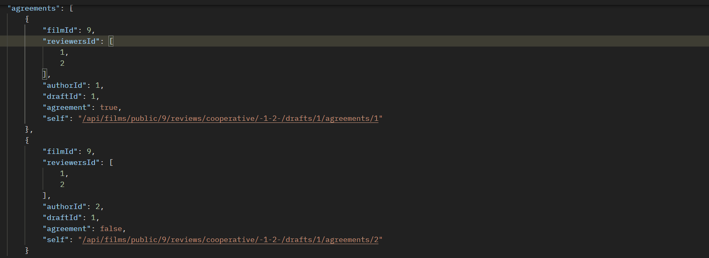
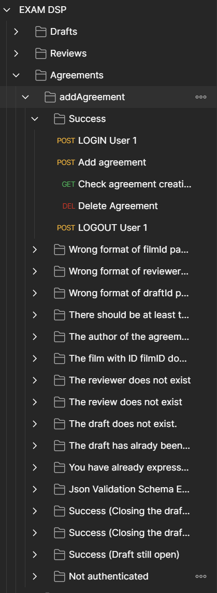

# Distributed Systems Programming - Exam call 01/02/2023

<div style="margin-left: auto;
            margin-right: auto;
            width: 50%">

|||
|:--:|:--:|
| **Author** | Giulia Bianchi|
| **Student ID** | 294547 |
| **Contact** | s294547@studenti.polito.it |
| **Course** | Distributed Systems Programming |
| **CFU** | 6 |
| **Teacher** | Riccardo Sisto |
</div>

1. [About this repository](#about-this-repository)
2. [Personal Assumptions](#personal-assumptions)
3. [API Design Choices](#api-design-choices)
	1. [Hierarchical Organization](#hierarchichal-organization)
	2. [Cooperative Reviews and Single Reviews](#cooperative-reviews-and-single-reviews)
    	1. [Defined Resources](#defined-resources)
	3. [Drafts and Agreements](#drafts-and-agreements)
    	1. [Defined Resources](#defined-resources-1)
	4. [Transparent URIs and HATEOAS](#transparent-uris-and-hateoas)
	5. [Operations Defined/Modified](#operations-definedmodified)
	6. [Query Parameters](#query-parameters)
4. [Full API Documentation](#full-api-documentation)
5. [Service Design](#service-design)
6. [Service Implementation](#service-implementation)
	1. [Passport](#passport)
	2. [Express Session](#express-session)
	3. [Cors](#cors)
	4. [Express JSON Validator Middleware](#express-json-validator-middleware)
	5. [Database](#database)
    	1. [Database Tables](#database-tables)
7. [API Tests](#api-tests)


## **About this repository**
This repository contains the design documents and the Javascript code service application of the **Film Library** exam call. The structure of this repository is the following:
- `JSON Schemas`: it contains the **design of the JSON Schemas** and the full **Open API documentation of the REST APIs**, including examples of JSON documents to be used when invoking the operations. The design choices are discussed in [API Design Choices](#api-design-choices). 
- `REST APIs Design`: it contains the full **Open API documentation of the REST APIs**. In particular, this directory contains:
   	- `openapi.yaml`: the file in which all the REST APIs are defined.
- `REST APIs Implementation`: it contains the code of the **Film Manager service** application. The Service Design and Implementation are discussed, respectively, in [Service Design](#service-design) and [Service Implementation](#service-implementation).
- `Images`: it contains the source images used in this document.
- `Tests`: it contains the Postman collection of API tests, along with the results. 

## **Personal Assumptions**
Before starting to design and develop APIs, some assumptions have been done:
- The user can issue single reviews, multiple single reviews and cooperative. As requested in the specifications of the exam, this has been done in a single operation.
- A set of users can be found in multiple cooperative reviews. For example, given a review made by the users 1 and 2, they cannot do another cooperative review alone, but they can do a cooperative review with a third user. 
- The users need to do fine-grained operations (e.g. retrieve a single review for a film, retrieve a cooperative review for a film, delete a draft, get a draft, delete an agreement...), since they must be able to browse through a large number of different types of reviews.


## **API Design Choices**
This section contains the documentation of the design choices taken to develop the APIs. 
This design extendes the solution developed during the fist laboratory. At first, I identified the new resoruces, considering their relation with the other existing resources:
```
films  
│
└─── public
│   │   {filmId}
│   └───reviews  
│       │   
│       └─── cooperative
|       │   │    {reviewersId}
|       │   └─── drafts
|       │       │   {draftId}
|       │       └─── agreements
|       |                {agreementId}
|       │      
|       └───single
|             {reviewerId}
|   
└─── private
        {filmId}         
``` 
### **Hierarchichal Organization**

The resources have been organized and identified in a hierarchical way, indipendent from the URIs that have been choosen after the resource identification step.

### **Cooperative Reviews and Single Reviews **

**The review, draft and agreement resource are realted to the public film resource, since in the original specifications of the laboratory all the operations related to a review are done considering a film (`e.g. the operation to retrieve the list of the reviews of a public film`). This relationship has been kept in the mapping from the name of the resources to their URIs, as it is done in the proposed solution of laboratory 1**

I wanted to consider two different resources for cooperative and single reviews, even if their structure is almost the same implemented in the laboratory solution. 

This decision has been taken because there are some operations that are done only on a kind of review: for example, you can issue a draft just for a cooperative review, while you can update only a single review. 

I also assumed that the **users must be able to browse through a large number of different types of reviews**: e.g., to retrieve a set of cooperative reviews given a film, to retrieve a set of single reviews given a film,to retrieve a specific cooperative review of a film or a specific single review of a film... `The amount and kind of operations needed shows the need to use a small granularity in resource definition`.


Some operations are executed both on the cooperative and single reviews (e.g. deleting a review, issue a review..), so these operations are related to the higher level `reviews` resources.

#### **Defined Resources**
- `films/public/{filmId}/reviews`

  The single and cooperative reviews issued for the public film with ID filmId
- `films/public/{filmId}/reviews/{reviewersId}`

  The single/cooperative review issued to the user/list of users with ID in the list reviewersId for the public film with ID filmId
- `films/public/{filmId}/reviews/cooperative`

  The cooperative reviews issued for the public film with ID filmId

- `films/public/{filmId}/reviews/cooperative/{reviewersId}`

  The cooperative review issued to the list of users with ID in the list reviewersId for the public film with ID filmId
- `films/public/{filmId}/reviews/single`

  The single reviews issued for the public film with ID filmId

- `films/public/{filmId}/reviews/single/{reviewerId}`
  The single review issued to the user with ID reviewerId for the public film with ID filmId

### **Drafts and agreements**
The agreements have been considered as a new resource: even if this is a fine-grained choice, I supposed there was the necessity to give the possibility to the users not only to add agreements to the review's drafts, but also to retrieve them and delete/get one of them. 
Also in this case, the amount and kind of operations needed shows the need to use a small granularity in resource definition.

#### **Defined Resources**
- `films/public/{filmId}/reviews/cooperative/{reviewersId}/drafts`

  The drafts for the cooperative review issued to the list of users with ID in the list reviewersId for the public film with ID filmId
- `films/public/{filmId}/reviews/cooperative/{reviewersId}/drafts/{draftId}`

  The draft with ID draftID for the cooperative review issued to the list of users with ID in the list reviewersId for the public film with ID filmId
- `films/public/{filmId}/reviews/cooperative/{reviewersId}/drafts/{draftId}/agreements`

  The agreements of the draft with ID draftID for the cooperative review issued to the list of users with ID in the list reviewersId for the public film with ID filmId
- `films/public/{filmId}/reviews/cooperative/{reviewersId}/drafts/{draftId}/agreements/{authorID}`

  The agreement made by the user with ID authorID of the draft with ID draftID for the cooperative review issued to the list of users with ID in the list reviewersId for the public film with ID filmId


### **Transparent URIs and HATEOAS**
Regarding the mapping from the name of the resources to their URIs, I decided to use 'transparent' URIs, even if I have also followed the HATEOAS principle. I preferred this approach because it makes URIs self-explanatory.

The APIs have been designed to follow the HATEOAS principle, so the response messages always include the URI of the resources. 


_example of AGREEMENT resource returned with 'self' link for HATEOAS_

### **Operations Defined/Modified**
- `films/public/invited`

  **GET:**  
  Show all the review invitations for a film of the logged-in user. It shows both the cooperative/single reviews, so the implementation of the methods `getInvitedFilms` and `getInvitedFilmsTotal` in `FilmService.js` has been changed in the appropriate way (in particular, the SQL queries have been changed).

- `films/public/{filmId}/reviews`

  **DELETE:**  
  Delete a public film. If the film has some cooperative reviews/drafts/agreements, they are also deleted, so I needed to add the removal of `drafts` and `agreements` in the already provided method. 

- `films/public/{filmId}/reviews`

  **POST:**  
  Issue a single/multiple single/cooperative review for a film with ID filmId.

  **GET:**  
  Get all the single/cooperative reviews for a film with ID filmId, if a userId is specified all its reviews are retrieved. 

- `films/public/{filmId}/reviews/{reviewersId}`

  **GET:**  
  Get a single/cooperative review for a film with ID filmId made by a user/list of users.

  **DELETE:**  
  Delete a single/cooperative review for a film with ID filmId made by a user/list of users. If it is a cooperative review, the related drafts and agreements are deleted

- `films/public/{filmId}/reviews/cooperative`

  **GET:** 
  Get the cooperative reviews issued for the public film with ID filmId. If a user/list of users is specified, all its/their cooperative reviews are retrieved.

- `films/public/{filmId}/reviews/cooperative/{reviewersId}`

  **GET:**
  Get the cooperative review issued to the list of users with ID in the list reviewersId for the public film with ID filmId
  
- `films/public/{filmId}/reviews/single`

  **GET:**
  Get the single reviews issued for the public film with ID filmId

- `films/public/{filmId}/reviews/single/{reviewerId}`

  **GET:**
  Get the single review issued to the user with ID reviewerId for the public film with ID filmId

  **UPDATE**
  Update the single review issued to the user with ID reviewerId for the public film with ID filmId

- `films/public/{filmId}/reviews/cooperative/{reviewersId}/drafts`

  **POST**
  Issue a draft for the cooperative review issued to the list of users with ID in the list reviewersId for the public film with ID filmId. An agreement is created for the author of the draft. It cannot be issued if there is another open draft or the review is completed.

  **GET**
  Retrieve the drafts for the cooperative review issued to the list of users with ID in the list reviewersId for the public film with ID filmId
- `films/public/{filmId}/reviews/cooperative/{reviewersId}/drafts/{draftId}`

  **GET**
  Get the draft with ID draftID for the cooperative review issued to the list of users with ID in the list reviewersId for the public film with ID filmId.

  **DELETE**
  Delete the draft with ID draftID for the cooperative review issued to the list of users with ID in the list reviewersId for the public film with ID filmId. The draft must not be closed, it also deletes the related agreements.

- `films/public/{filmId}/reviews/cooperative/{reviewersId}/drafts/{draftId}/agreements`

  **GET**
  Get the agreements of the draft with ID draftID for the cooperative review issued to the list of users with ID in the list reviewersId for the public film with ID filmId.

  **POST**
  Issue an agreement to the draft with ID draftID for the cooperative review issued to the list of users with ID in the list reviewersId for the public film with ID filmId. If it is the last one, the draft is closed and, if there is no disagreement, the review is completed with the draft. The draft must not be closed to issue an agreement.
- `films/public/{filmId}/reviews/cooperative/{reviewersId}/drafts/{draftId}/agreements/{authorID}`

  **GET**
  Get the agreement made by the user with ID authorID of the draft with ID draftID for the cooperative review issued to the list of users with ID in the list reviewersId for the public film with ID filmId

  **DELETE**
  Delete the agreement made by the user with ID authorID of the draft with ID draftID for the cooperative review issued to the list of users with ID in the list reviewersId for the public film with ID filmId. The agreement must not be closed.

### **Query Parameters** 
In the modified/defined operations I gave the possibility to use some new query parameters. 

To issue a new film review with `POST /api/films/public/{filmId}/reviews` the user must add a query parameter `type`, which can assume the values `single` or `cooperative`. This decision was necessary since the user can issue both multiple single reviews and cooperative reviews, so the number of reviewers in the body of the request is not helpful to decide which kind of review needs to be issued. 

To get reviews with `GET /api/films/public/{filmId}/reviews` the user may specify a query parameter `reviewerId`, to get all the single/cooprative reviews in which a user with the given ID is one of  the  reviewers or the single reviewer. Since this operation may return multiple resources,  it was necessary to use a **query** paramter, not a **path** parameter, that is required to return a single resource.

To get cooperative reviews with `GET /api/films/public/{filmId}/reviews/cooperative` the user may specify a query parameter `reviewersId`, to get all the single/cooprative reviews in which the reviewers include a user or a list of users with the given IDs. Since this operation may return multiple resources,  it was necessary to use a **query** paramter, not a **path** parameter, that is required to return a single resource.


## **Full API Documentation**

`POST /api/films/public/{filmId}/reviews`

*Issue film review to some users*

The film with ID filmId is assigned to one or more users for review and the corresponding reviews are created. The users are specified in the review representations in the request body. A query parameter "type" is used to specify if multiple single or cooperative reviews are issued. This operation can only be performed by the owner.

> Body parameter

```json
{
  "reviewersId": [
    0
  ]
}
```

<h3 id="issuefilmreview-parameters">Parameters</h3>

|Name|In|Type|Required|Description|
|---|---|---|---|---|
|filmId|path|integer(int64)|true|ID of the film|
|type|query|string|true|The operation type ("cooperative" or "single"). If cooperative, the list of users must be of at least 2.|
|body|body|object|true|the users to whom the new film review is issued|
|» reviewersId|body|[integer]|true|none|

> Example responses

> 201 Response

```json
{
  "filmId": 9,
  "reviewersId": [
    1,
    2,
    3
  ],
  "completed": false,
  "self": "/api/films/public/9/reviews/-1-2-3-",
  "self2": "/api/films/public/9/reviews/cooperative/-1-2-3-"
}
```

> 400 Response

```json
{
  "errors": [
    {
      "param": "Server",
      "msg": "Wrong format of filmId path parameter"
    }
  ]
}
```

> 401 Response

```json
{
  "error": "Not authorized"
}
```

> 403 Response

```json
{
  "errors": [
    {
      "param": "Server",
      "msg": "The user is not the owner of the film"
    }
  ]
}
```

> 404 Response

```json
{
  "errors": [
    {
      "param": "Server",
      "msg": "The film with ID filmID does not exist"
    }
  ]
}
```

> 500 Response

```json
{
  "errors": [
    {
      "param": "Server",
      "msg": "string"
    }
  ]
}
```

<h3 id="issuefilmreview-responses">Responses</h3>

|Status|Meaning|Description|Schema|
|---|---|---|---|
|201|[Created](https://tools.ietf.org/html/rfc7231#section-6.3.2)|Created|[Review](#schemareview)|
|400|[Bad Request](https://tools.ietf.org/html/rfc7231#section-6.5.1)|Bad Request|Inline|
|401|[Unauthorized](https://tools.ietf.org/html/rfc7235#section-3.1)|Unauthorized|Inline|
|403|[Forbidden](https://tools.ietf.org/html/rfc7231#section-6.5.3)|Forbidden (the creator of the review is not the owner of the film, the film is a private one)|[Error](#schemaerror)|
|404|[Not Found](https://tools.ietf.org/html/rfc7231#section-6.5.4)|Not Found|[Error](#schemaerror)|
|500|[Internal Server Error](https://tools.ietf.org/html/rfc7231#section-6.6.1)|Internal Server Error|[Error](#schemaerror)|


<aside class="warning">
To perform this operation, you must be authenticated by means of one of the following methods:
cookieAuth
</aside>

`GET /api/films/public/{filmId}/reviews`

*Retrieve the list of all the cooperative/single reviews that have been issued/completed for a film*

All the cooperative/single reviews that have been issued/completed for the film with ID filmId are retrieved. A pagination mechanism is implemented to limit the size of messages. This operation does not require authentication. If we want to retrieve all the single/public reviews made by an user, we must  use the query parameter reviewerId to specify an array of IDS. 

<h3 id="getfilmreviews-parameters">Parameters</h3>

|Name|In|Type|Required|Description|
|---|---|---|---|---|
|filmId|path|integer(int64)|true|ID of the film whose reviews must be retrieved|
|pageNo|query|integer|false|ID of the requested page (if absent, the first page is returned)'|
|reviewerId|query|integer|false|ID of the reviewer for which we want to see the cooperative/single reviews '|

> Example responses

> 200 Response

```json
{
  "totalPages": 1,
  "currentPage": 1,
  "totalItems": 1,
  "reviews": [
    {
      "filmId": 9,
      "reviewersId": [
        1,
        2,
        3
      ],
      "completed": false,
      "self": "/api/films/public/9/reviews/-1-2-3-",
      "self2": "/api/films/public/9/reviews/cooperative/-1-2-3-"
    }
  ]
}
```

> 400 Response

```json
{
  "errors": [
    {
      "param": "Server",
      "msg": "Wrong format of filmId path parameter"
    }
  ]
}
```

> 404 Response

```json
{
  "errors": [
    {
      "param": "Server",
      "msg": "The film with ID filmID does not exist\""
    }
  ]
}
```

> 500 Response

```json
{
  "errors": [
    {
      "param": "Server",
      "msg": "string"
    }
  ]
}
```

<h3 id="getfilmreviews-responses">Responses</h3>

|Status|Meaning|Description|Schema|
|---|---|---|---|
|200|[OK](https://tools.ietf.org/html/rfc7231#section-6.3.1)|Successful operation|Inline|
|400|[Bad Request](https://tools.ietf.org/html/rfc7231#section-6.5.1)|Bad Request|Inline|
|404|[Not Found](https://tools.ietf.org/html/rfc7231#section-6.5.4)|Not Found|[Error](#schemaerror)|
|500|[Internal Server Error](https://tools.ietf.org/html/rfc7231#section-6.6.1)|Internal Server Error|[Error](#schemaerror)|


<aside class="success">
This operation does not require authentication
</aside>


`GET /api/films/public/{filmId}/reviews/{reviewersId}`

*Retrieve a single/cooperative review that has been issued/completed for a film*

The review of the film with ID filmID issued to the user/list of users with ID in the list reviewersId is retrieved. This operation does not require authentication. 

<h3 id="getreview-parameters">Parameters</h3>

|Name|In|Type|Required|Description|
|---|---|---|---|---|
|filmId|path|integer(int64)|true|ID of the film whose reviews must be retrieved|
|reviewersId|path|string|true|the list of user IDs to whom the review has been issued|

> Example responses

> 200 Response

```json
{
  "filmId": 9,
  "reviewersId": [
    1,
    2,
    3
  ],
  "completed": false,
  "self": "/api/films/public/9/reviews/-1-2-3-",
  "self2": "/api/films/public/9/reviews/cooperative/-1-2-3-"
}
```

> 400 Response

```json
{
  "errors": [
    {
      "param": "Server",
      "msg": "Wrong format of filmId path parameter"
    }
  ]
}
```

> 404 Response

```json
{
  "errors": [
    {
      "param": "Server",
      "msg": "The film with ID filmID does not exist\""
    }
  ]
}
```

> 500 Response

```json
{
  "errors": [
    {
      "param": "Server",
      "msg": "string"
    }
  ]
}
```

<h3 id="getreview-responses">Responses</h3>

|Status|Meaning|Description|Schema|
|---|---|---|---|
|200|[OK](https://tools.ietf.org/html/rfc7231#section-6.3.1)|Successful operation|[Review](#schemareview)|
|400|[Bad Request](https://tools.ietf.org/html/rfc7231#section-6.5.1)|Bad Request|Inline|
|404|[Not Found](https://tools.ietf.org/html/rfc7231#section-6.5.4)|Not Found|[Error](#schemaerror)|
|500|[Internal Server Error](https://tools.ietf.org/html/rfc7231#section-6.6.1)|Internal Server Error|[Error](#schemaerror)|


<aside class="success">
This operation does not require authentication
</aside>


`DELETE /api/films/public/{filmId}/reviews/{reviewersId}`

*Delete a review invitation*

The review of the film with ID filmId and issued to the user/list of users with ID in the list reviewersId is deleted. This operation can only be performed by the owner, and only if the review has not yet been completed by the reviewer. If the review is a cooperative one, also the drafts and the agreements must be deleted.

<h3 id="deletereview-parameters">Parameters</h3>

|Name|In|Type|Required|Description|
|---|---|---|---|---|
|filmId|path|integer(int64)|true|ID of the film whose review invitation must be deleted|
|reviewersId|path|string|true|the list of user IDs to whom the review has been issued|

> Example responses

> 400 Response

```json
{
  "errors": [
    {
      "param": "Server",
      "msg": "Wrong format of filmId path parameter"
    }
  ]
}
```

> 401 Response

```json
{
  "error": "Not authorized"
}
```

> 403 Response

```json
{
  "errors": [
    {
      "param": "Server",
      "msg": "The user is not the owner of the film"
    }
  ]
}
```

> 404 Response

```json
{
  "errors": [
    {
      "param": "Server",
      "msg": "The film with ID filmID does not exist"
    }
  ]
}
```

> 409 Response

```json
{
  "errors": [
    {
      "param": "Server",
      "msg": "The review has been already completed, so the invitation cannot be deleted anymore."
    }
  ]
}
```

> 500 Response

```json
{
  "errors": [
    {
      "param": "Server",
      "msg": "string"
    }
  ]
}
```

<h3 id="deletereview-responses">Responses</h3>

|Status|Meaning|Description|Schema|
|---|---|---|---|
|204|[No Content](https://tools.ietf.org/html/rfc7231#section-6.3.5)|Successful operation - No Content|None|
|400|[Bad Request](https://tools.ietf.org/html/rfc7231#section-6.5.1)|Bad Request|Inline|
|401|[Unauthorized](https://tools.ietf.org/html/rfc7235#section-3.1)|Unauthorized|Inline|
|403|[Forbidden](https://tools.ietf.org/html/rfc7231#section-6.5.3)|Forbidden|[Error](#schemaerror)|
|404|[Not Found](https://tools.ietf.org/html/rfc7231#section-6.5.4)|Not Found|[Error](#schemaerror)|
|409|[Conflict](https://tools.ietf.org/html/rfc7231#section-6.5.8)|Conflict (ex. the review has already been completed  )|[Error](#schemaerror)|
|500|[Internal Server Error](https://tools.ietf.org/html/rfc7231#section-6.6.1)|Internal Server Error|[Error](#schemaerror)|


<aside class="warning">
To perform this operation, you must be authenticated by means of one of the following methods:
cookieAuth
</aside>


`GET /api/films/public/{filmId}/reviews/cooperative`

*Retrieve the list of all cooperative reviews that have been issued/completed for a film*

All the cooperative reviews that have been issued/completed for the film with ID filmId are retrieved. A pagination mechanism is implemented to limit the size of messages. This operation does not require authentication. If using the query parameter reviewersID, i can return all the cooperative reviews in which the  users of the list reviewersID are present.

<h3 id="getcooperativefilmreviews-parameters">Parameters</h3>

|Name|In|Type|Required|Description|
|---|---|---|---|---|
|filmId|path|integer(int64)|true|ID of the film whose reviews must be retrieved|
|pageNo|query|integer|false|ID of the requested page (if absent, the first page is returned)'|
|reviewersId|query|string|false|the list of user IDs to whom the review has been issued|

> Example responses

> 200 Response

```json
{
  "totalPages": 1,
  "currentPage": 1,
  "totalItems": 1,
  "reviews": [
    {
      "filmId": 9,
      "reviewersId": [
        1,
        2
      ],
      "completed": false,
      "self": "/api/films/public/9/reviews/-1-2-",
      "self2": "/api/films/public/9/reviews/cooperative/-1-2-"
    }
  ]
}
```

> 400 Response

```json
{
  "errors": [
    {
      "param": "Server",
      "msg": "Wrong format of filmId path parameter"
    }
  ]
}
```

> 404 Response

```json
{
  "errors": [
    {
      "param": "Server",
      "msg": "The film with ID filmID does not exist"
    }
  ]
}
```

> 500 Response

```json
{
  "errors": [
    {
      "param": "Server",
      "msg": "string"
    }
  ]
}
```

<h3 id="getcooperativefilmreviews-responses">Responses</h3>

|Status|Meaning|Description|Schema|
|---|---|---|---|
|200|[OK](https://tools.ietf.org/html/rfc7231#section-6.3.1)|Successful operation|Inline|
|400|[Bad Request](https://tools.ietf.org/html/rfc7231#section-6.5.1)|Bad Request|Inline|
|404|[Not Found](https://tools.ietf.org/html/rfc7231#section-6.5.4)|Not Found|[Error](#schemaerror)|
|500|[Internal Server Error](https://tools.ietf.org/html/rfc7231#section-6.6.1)|Internal Server Error|[Error](#schemaerror)|


<aside class="success">
This operation does not require authentication
</aside>


`GET /api/films/public/{filmId}/reviews/cooperative/{reviewersId}`

*Retrieve a cooperative review that has been issued/completed for a film*

The cooperative review of the film with ID filmID issued to the users  with ID in the list reviewersId is retrieved. This operation does not require authentication. 

<h3 id="getcooperativereview-parameters">Parameters</h3>

|Name|In|Type|Required|Description|
|---|---|---|---|---|
|filmId|path|integer(int64)|true|ID of the film whose reviews must be retrieved|
|reviewersId|path|string|true|the list of user IDs to whom the review has been issued|

> Example responses

> 200 Response

```json
{
  "filmId": 9,
  "reviewersId": [
    1,
    2
  ],
  "completed": false,
  "self": "/api/films/public/9/reviews/-1-2-",
  "self2": "/api/films/public/9/reviews/cooperative/-1-2-"
}
```

> 400 Response

```json
{
  "errors": [
    {
      "param": "Server",
      "msg": "Wrong format of filmId path parameter"
    }
  ]
}
```

> 404 Response

```json
{
  "errors": [
    {
      "param": "Server",
      "msg": "The film with ID filmID does not exist"
    }
  ]
}
```

> 500 Response

```json
{
  "errors": [
    {
      "param": "Server",
      "msg": "string"
    }
  ]
}
```

<h3 id="getcooperativereview-responses">Responses</h3>

|Status|Meaning|Description|Schema|
|---|---|---|---|
|200|[OK](https://tools.ietf.org/html/rfc7231#section-6.3.1)|Successful operation|[Review](#schemareview)|
|400|[Bad Request](https://tools.ietf.org/html/rfc7231#section-6.5.1)|Bad Request|Inline|
|404|[Not Found](https://tools.ietf.org/html/rfc7231#section-6.5.4)|Not Found|[Error](#schemaerror)|
|500|[Internal Server Error](https://tools.ietf.org/html/rfc7231#section-6.6.1)|Internal Server Error|[Error](#schemaerror)|


<aside class="success">
This operation does not require authentication
</aside>


`GET /api/films/public/{filmId}/reviews/single`

*Retrieve the list of all single reviews that have been issued/completed for a film*

All the single reviews that have been issued/completed for the film with ID filmId are retrieved. A pagination mechanism is implemented to limit the size of messages. This operation does not require authentication.

<h3 id="getsinglefilmreviews-parameters">Parameters</h3>

|Name|In|Type|Required|Description|
|---|---|---|---|---|
|filmId|path|integer(int64)|true|ID of the film whose reviews must be retrieved|
|pageNo|query|integer|false|ID of the requested page (if absent, the first page is returned)'|

> Example responses

> 200 Response

```json
{
  "totalPages": 1,
  "currentPage": 1,
  "totalItems": 1,
  "reviews": [
    {
      "filmId": 9,
      "reviewersId": [
        1
      ],
      "completed": false,
      "self": "/api/films/public/9/reviews/-1-",
      "self2": "/api/films/public/9/reviews/single/-1-"
    }
  ]
}
```

> 400 Response

```json
{
  "errors": [
    {
      "param": "Server",
      "msg": "Wrong format of filmId path parameter"
    }
  ]
}
```

> 404 Response

```json
{
  "errors": [
    {
      "param": "Server",
      "msg": "The film with ID filmID does not exist"
    }
  ]
}
```

> 500 Response

```json
{
  "errors": [
    {
      "param": "Server",
      "msg": "string"
    }
  ]
}
```

<h3 id="getsinglefilmreviews-responses">Responses</h3>

|Status|Meaning|Description|Schema|
|---|---|---|---|
|200|[OK](https://tools.ietf.org/html/rfc7231#section-6.3.1)|Successful operation|Inline|
|400|[Bad Request](https://tools.ietf.org/html/rfc7231#section-6.5.1)|Bad Request|Inline|
|404|[Not Found](https://tools.ietf.org/html/rfc7231#section-6.5.4)|Not Found|[Error](#schemaerror)|
|500|[Internal Server Error](https://tools.ietf.org/html/rfc7231#section-6.6.1)|Internal Server Error|[Error](#schemaerror)|


<aside class="success">
This operation does not require authentication
</aside>


`GET /api/films/public/{filmId}/reviews/single/{reviewerId}`

*Retrieve a single review that has been issued/completed for a film*

The review of the film with ID filmID issued to the user with ID reviewerId is retrieved. This operation does not require authentication. 

<h3 id="getsinglereview-parameters">Parameters</h3>

|Name|In|Type|Required|Description|
|---|---|---|---|---|
|filmId|path|integer(int64)|true|ID of the film whose reviews must be retrieved|
|reviewerId|path|integer|true|the  user IDs to whom the review has been issued|

> Example responses

> 200 Response

```json
{
  "filmId": 9,
  "reviewersId": [
    1
  ],
  "completed": false,
  "self": "/api/films/public/9/reviews/-1-",
  "self2": "/api/films/public/9/reviews/single/-1-"
}
```

> 400 Response

```json
{
  "errors": [
    {
      "param": "Server",
      "msg": "Wrong format of filmId path parameter"
    }
  ]
}
```

> 404 Response

```json
{
  "errors": [
    {
      "param": "Server",
      "msg": "The film with ID filmID does not exist"
    }
  ]
}
```

> 500 Response

```json
{
  "errors": [
    {
      "param": "Server",
      "msg": "string"
    }
  ]
}
```

<h3 id="getsinglereview-responses">Responses</h3>

|Status|Meaning|Description|Schema|
|---|---|---|---|
|200|[OK](https://tools.ietf.org/html/rfc7231#section-6.3.1)|Successful operation|[Review](#schemareview)|
|400|[Bad Request](https://tools.ietf.org/html/rfc7231#section-6.5.1)|Bad Request|Inline|
|404|[Not Found](https://tools.ietf.org/html/rfc7231#section-6.5.4)|Not Found|[Error](#schemaerror)|
|500|[Internal Server Error](https://tools.ietf.org/html/rfc7231#section-6.6.1)|Internal Server Error|[Error](#schemaerror)|


<aside class="success">
This operation does not require authentication
</aside>


`PUT /api/films/public/{filmId}/reviews/single/{reviewerId}`

*Complete a single review*

The single review of the film with ID filmId and issued to the user with ID reviewerId is completed. This operation only allows setting the "completed" property to the "true" value, and changing the values of the "reviewDate", "rating", and "review" properties. This operation can be performed only by the invited reviewer.

> Body parameter

```json
{
  "completed": "true",
  "reviewDate": "2019-08-24",
  "rating": 1,
  "review": "string"
}
```

<h3 id="updatesinglereview-parameters">Parameters</h3>

|Name|In|Type|Required|Description|
|---|---|---|---|---|
|filmId|path|integer(int64)|true|ID of the film whose review must be completed|
|reviewerId|path|integer(int64)|true|ID of the user to whom the review has been issued|
|body|body|object|false|The properties of the Review object that must be updated|
|» completed|body|boolean|true|none|
|» reviewDate|body|string(date)|false|the date when the review has been completed by the invited user|
|» rating|body|integer|false|the rating the reviewer has given to the film|
|» review|body|string|false|a textual description of the review|

> Example responses

> 400 Response

```json
{
  "errors": [
    {
      "param": "Server",
      "msg": "Wrong format of filmId path parameter"
    }
  ]
}
```

> 401 Response

```json
{
  "error": "Not authorized"
}
```

> 403 Response

```json
{
  "errors": [
    {
      "param": "Server",
      "msg": "The reviewerId is not equal the id of the requesting user."
    }
  ]
}
```

> 404 Response

```json
{
  "errors": [
    {
      "param": "Server",
      "msg": "The film with ID filmID does not exist"
    }
  ]
}
```

> 409 Response

```json
{
  "errors": [
    {
      "param": "Server",
      "msg": "The review is already completed"
    }
  ]
}
```

> 500 Response

```json
{
  "errors": [
    {
      "param": "Server",
      "msg": "string"
    }
  ]
}
```

<h3 id="updatesinglereview-responses">Responses</h3>

|Status|Meaning|Description|Schema|
|---|---|---|---|
|204|[No Content](https://tools.ietf.org/html/rfc7231#section-6.3.5)|No Content|None|
|400|[Bad Request](https://tools.ietf.org/html/rfc7231#section-6.5.1)|Bad Request|Inline|
|401|[Unauthorized](https://tools.ietf.org/html/rfc7235#section-3.1)|Unauthorized|Inline|
|403|[Forbidden](https://tools.ietf.org/html/rfc7231#section-6.5.3)|Forbidden ( ex. the user who wants to make the update must be the reviewer)|[Error](#schemaerror)|
|404|[Not Found](https://tools.ietf.org/html/rfc7231#section-6.5.4)|Not Found|[Error](#schemaerror)|
|409|[Conflict](https://tools.ietf.org/html/rfc7231#section-6.5.8)|Conflict ( ex. The review is already completed)|[Error](#schemaerror)|
|500|[Internal Server Error](https://tools.ietf.org/html/rfc7231#section-6.6.1)|Internal Server Error|[Error](#schemaerror)|


<aside class="warning">
To perform this operation, you must be authenticated by means of one of the following methods:
cookieAuth
</aside>


`POST /api/films/public/{filmId}/reviews/cooperative/{reviewersId}/drafts`

*Issue a draft of a cooperative film review*

A draft for a cooperative review is created. This operation can only be performed by one of the reviewers. No other draft should have the "open" status for the same review. The review must not be completed.

> Body parameter

```json
{
  "rating": 1,
  "review": "string"
}
```

<h3 id="addcooperativereviewdraft-parameters">Parameters</h3>

|Name|In|Type|Required|Description|
|---|---|---|---|---|
|filmId|path|integer(int64)|true|ID of the film|
|reviewersId|path|string|true|the list of user IDs to whom the review has been issued|
|body|body|object|true|the new draft of the cooperative film review, including the users to whom they are issued|
|» rating|body|integer|true|the rating the reviewer has given to the film|
|» review|body|string|true|a textual description of the review|

> Example responses

> 201 Response

```json
{
  "draft": {
    "film": 9,
    "reviewersId": [
      1,
      2,
      3
    ],
    "authorId": 1,
    "draftId": 1,
    "rating": 4,
    "review": "Sooo boring..",
    "closed": false,
    "self": "/api/films/public/9/reviews/cooperative/-1-2-3-/drafts/1"
  },
  "agreement": {
    "film": 9,
    "reviewersId": [
      1,
      2,
      3
    ],
    "authorId": 1,
    "draftId": 1,
    "agreement": true,
    "self": "/api/films/public/9/reviews/cooperative/-1-2-3-/drafts/1/agreements/1}"
  }
}
```

> 400 Response

```json
{
  "errors": [
    {
      "param": "Server",
      "msg": "Wrong format of filmId path parameter"
    }
  ]
}
```

> 401 Response

```json
{
  "error": "Not authorized"
}
```

> 403 Response

```json
{
  "errors": [
    {
      "param": "Server",
      "msg": "The author of the draft is not a reviewer"
    }
  ]
}
```

> 404 Response

```json
{
  "errors": [
    {
      "param": "Server",
      "msg": "The film with ID filmID does not exist"
    }
  ]
}
```

> 409 Response

```json
{
  "errors": [
    {
      "param": "Server",
      "msg": "The review has already been completed"
    }
  ]
}
```

> 500 Response

```json
{
  "errors": [
    {
      "param": "Server",
      "msg": "string"
    }
  ]
}
```

<h3 id="addcooperativereviewdraft-responses">Responses</h3>

|Status|Meaning|Description|Schema|
|---|---|---|---|
|201|[Created](https://tools.ietf.org/html/rfc7231#section-6.3.2)|Created|Inline|
|400|[Bad Request](https://tools.ietf.org/html/rfc7231#section-6.5.1)|Bad Request|Inline|
|401|[Unauthorized](https://tools.ietf.org/html/rfc7235#section-3.1)|Unauthorized|Inline|
|403|[Forbidden](https://tools.ietf.org/html/rfc7231#section-6.5.3)|Forbidden (ex. the author ofthe draft is not a reviewer)|[Error](#schemaerror)|
|404|[Not Found](https://tools.ietf.org/html/rfc7231#section-6.5.4)|Not Found|[Error](#schemaerror)|
|409|[Conflict](https://tools.ietf.org/html/rfc7231#section-6.5.8)|Conflict (e.g., the review has already been completed)|[Error](#schemaerror)|
|500|[Internal Server Error](https://tools.ietf.org/html/rfc7231#section-6.6.1)|Internal Server Error|[Error](#schemaerror)|


<aside class="warning">
To perform this operation, you must be authenticated by means of one of the following methods:
cookieAuth
</aside>


`GET /api/films/public/{filmId}/reviews/cooperative/{reviewersId}/drafts`

*Retrieve the drafts of a cooperative review that has been issued/completed for a film*

All the drafts of a cooperative review that has been issued/completed for the film with ID filmId are retrieved. A pagination mechanism is implemented to limit the size of messages. This operation does not require authentication. If using the query parameter reviewersID, i can return all the cooperative reviews in which the  users of the reviewersID are present.

<h3 id="getcooperativereviewdrafts-parameters">Parameters</h3>

|Name|In|Type|Required|Description|
|---|---|---|---|---|
|filmId|path|integer(int64)|true|ID of the film whose reviews must be retrieved|
|pageNo|query|integer|false|ID of the requested page (if absent, the first page is returned)'|
|reviewersId|path|string|true|the list of user IDs to whom the review has been issued|

> Example responses

> 200 Response

```json
{
  "totalPages": 1,
  "currentPage": 1,
  "totalItems": 1,
  "drafts": [
    {
      "film": 9,
      "reviewersId": [
        1,
        2,
        3
      ],
      "authorId": 1,
      "draftId": 1,
      "rating": 4,
      "review": "Sooo boring..",
      "closed": false,
      "self": "/api/films/public/9/reviews/cooperative/-1-2-3-/drafts/1"
    }
  ]
}
```

> 400 Response

```json
{
  "errors": [
    {
      "param": "Server",
      "msg": "Wrong format of filmId path parameter"
    }
  ]
}
```

> 404 Response

```json
{
  "errors": [
    {
      "param": "Server",
      "msg": "The film with ID filmID does not exist"
    }
  ]
}
```

> 500 Response

```json
{
  "errors": [
    {
      "param": "Server",
      "msg": "string"
    }
  ]
}
```

<h3 id="getcooperativereviewdrafts-responses">Responses</h3>

|Status|Meaning|Description|Schema|
|---|---|---|---|
|200|[OK](https://tools.ietf.org/html/rfc7231#section-6.3.1)|Successful operation|Inline|
|400|[Bad Request](https://tools.ietf.org/html/rfc7231#section-6.5.1)|Bad Request|Inline|
|404|[Not Found](https://tools.ietf.org/html/rfc7231#section-6.5.4)|Not Found|[Error](#schemaerror)|
|500|[Internal Server Error](https://tools.ietf.org/html/rfc7231#section-6.6.1)|Internal Server Error|[Error](#schemaerror)|


<aside class="success">
This operation does not require authentication
</aside>


`GET /api/films/public/{filmId}/reviews/cooperative/{reviewersId}/drafts/{draftId}`

*Retrieve the draft of a cooperative review that has been issued/completed for a film*

The draft of the cooperative review of the film with ID filmID issued to the users  with ID in the list reviewersId is retrieved. This operation does not require authentication. 

<h3 id="getcooperativereviewdraft-parameters">Parameters</h3>

|Name|In|Type|Required|Description|
|---|---|---|---|---|
|filmId|path|integer(int64)|true|ID of the film whose reviews must be retrieved|
|reviewersId|path|string|true|the list of user IDs to whom the review has been issued|
|draftId|path|integer(int64)|true|ID of the draft of the cooperative review|

> Example responses

> 200 Response

```json
{
  "film": 9,
  "reviewersId": [
    1,
    2,
    3
  ],
  "authorId": 1,
  "draftId": 1,
  "rating": 4,
  "review": "Sooo boring..",
  "closed": false,
  "self": "/api/films/public/9/reviews/cooperative/-1-2-3-/drafts/1"
}
```

> 400 Response

```json
{
  "errors": [
    {
      "param": "Server",
      "msg": "Wrong format of filmId path parameter"
    }
  ]
}
```

> 404 Response

```json
{
  "errors": [
    {
      "param": "Server",
      "msg": "The film with ID filmID does not exist"
    }
  ]
}
```

> 500 Response

```json
{
  "errors": [
    {
      "param": "Server",
      "msg": "string"
    }
  ]
}
```

<h3 id="getcooperativereviewdraft-responses">Responses</h3>

|Status|Meaning|Description|Schema|
|---|---|---|---|
|200|[OK](https://tools.ietf.org/html/rfc7231#section-6.3.1)|Successful operation|[Draft](#schemadraft)|
|400|[Bad Request](https://tools.ietf.org/html/rfc7231#section-6.5.1)|Bad Request|Inline|
|404|[Not Found](https://tools.ietf.org/html/rfc7231#section-6.5.4)|Not Found|[Error](#schemaerror)|
|500|[Internal Server Error](https://tools.ietf.org/html/rfc7231#section-6.6.1)|Internal Server Error|[Error](#schemaerror)|


<aside class="success">
This operation does not require authentication
</aside>


`DELETE /api/films/public/{filmId}/reviews/cooperative/{reviewersId}/drafts/{draftId}`

*Delete a review's draft*

The review's draft of the film with ID filmId and issued to the list of users with ID in the list reviewersId is deleted. This operation can only be performed by the draft owner, and only if the review has not yet been completed by the reviewers and if the draft has not been accepted. This operation must delete also the agreements related to the draft.

<h3 id="deletecooperativereviewdraft-parameters">Parameters</h3>

|Name|In|Type|Required|Description|
|---|---|---|---|---|
|filmId|path|integer(int64)|true|ID of the film whose review draft must be deleted|
|reviewersId|path|string|true|the list of user IDs to whom the review has been issued|
|draftId|path|integer(int64)|true|ID of the draft that must be deleted|

> Example responses

> 400 Response

```json
{
  "errors": [
    {
      "param": "Server",
      "msg": "Wrong format of filmId path parameter"
    }
  ]
}
```

> 401 Response

```json
{
  "error": "Not authorized"
}
```

> 403 Response

```json
{
  "errors": [
    {
      "param": "Server",
      "msg": "The draft owner is not the authenticated user"
    }
  ]
}
```

> 404 Response

```json
{
  "errors": [
    {
      "param": "Server",
      "msg": "The film with ID filmID does not exist"
    }
  ]
}
```

> 409 Response

```json
{
  "errors": [
    {
      "param": "Server",
      "msg": "The draft has already been closed"
    }
  ]
}
```

> 500 Response

```json
{
  "errors": [
    {
      "param": "Server",
      "msg": "string"
    }
  ]
}
```

<h3 id="deletecooperativereviewdraft-responses">Responses</h3>

|Status|Meaning|Description|Schema|
|---|---|---|---|
|204|[No Content](https://tools.ietf.org/html/rfc7231#section-6.3.5)|Successful operation - No Content|None|
|400|[Bad Request](https://tools.ietf.org/html/rfc7231#section-6.5.1)|Bad Request|Inline|
|401|[Unauthorized](https://tools.ietf.org/html/rfc7235#section-3.1)|Unauthorized|Inline|
|403|[Forbidden](https://tools.ietf.org/html/rfc7231#section-6.5.3)|Forbidden (eg, the draft belongs to another user)|[Error](#schemaerror)|
|404|[Not Found](https://tools.ietf.org/html/rfc7231#section-6.5.4)|Not Found|[Error](#schemaerror)|
|409|[Conflict](https://tools.ietf.org/html/rfc7231#section-6.5.8)|Conflict (e.g., the draft has already been closed)|[Error](#schemaerror)|
|500|[Internal Server Error](https://tools.ietf.org/html/rfc7231#section-6.6.1)|Internal Server Error|[Error](#schemaerror)|


<aside class="warning">
To perform this operation, you must be authenticated by means of one of the following methods:
cookieAuth
</aside>


`POST /api/films/public/{filmId}/reviews/cooperative/{reviewersId}/drafts/{draftId}/agreements`

*Issue a draft's agreement of a cooperative film review to some users*

An agreement for a draft for a cooperative review is created. This operation can only be performed by one of the reviewers.

> Body parameter

```json
{
  "agreement": true,
  "reason": "string"
}
```

<h3 id="addagreement-parameters">Parameters</h3>

|Name|In|Type|Required|Description|
|---|---|---|---|---|
|filmId|path|integer(int64)|true|ID of the film|
|reviewersId|path|string|true|the list of user IDs to whom the review has been issued|
|draftId|path|integer(int64)|true|ID of the draft|
|body|body|object|true|the agreement value for the cooperative review|
|» agreement|body|boolean|true|none|
|» reason|body|string|false|none|

> Example responses

> 201 Response

```json
{
  "agreement": {
    "filmId": 11,
    "reviewersId": [
      1,
      2,
      3
    ],
    "authorId": 3,
    "draftId": 1,
    "agreement": false,
    "self": "/api/films/public/11/reviews/cooperative/-1-2-3-/drafts/1/agreements/3"
  }
}
```

> 400 Response

```json
{
  "errors": [
    {
      "param": "Server",
      "msg": "Wrong format of filmId path parameter"
    }
  ]
}
```

> 401 Response

```json
{
  "error": "Not authorized"
}
```

> 403 Response

```json
{
  "errors": [
    {
      "param": "Server",
      "msg": "The author of the agreement is not a reviewer"
    }
  ]
}
```

> 404 Response

```json
{
  "errors": [
    {
      "param": "Server",
      "msg": "The film with ID filmID does not exist"
    }
  ]
}
```

> 409 Response

```json
{
  "errors": [
    {
      "param": "Server",
      "msg": "The draft has already been closed"
    }
  ]
}
```

> 500 Response

```json
{
  "errors": [
    {
      "param": "Server",
      "msg": "string"
    }
  ]
}
```

<h3 id="addagreement-responses">Responses</h3>

|Status|Meaning|Description|Schema|
|---|---|---|---|
|201|[Created](https://tools.ietf.org/html/rfc7231#section-6.3.2)|Created|Inline|
|400|[Bad Request](https://tools.ietf.org/html/rfc7231#section-6.5.1)|Bad Request|Inline|
|401|[Unauthorized](https://tools.ietf.org/html/rfc7235#section-3.1)|Unauthorized|Inline|
|403|[Forbidden](https://tools.ietf.org/html/rfc7231#section-6.5.3)|Forbidden (e.g., the author of the agreement is not a reviewer)|[Error](#schemaerror)|
|404|[Not Found](https://tools.ietf.org/html/rfc7231#section-6.5.4)|Not Found|[Error](#schemaerror)|
|409|[Conflict](https://tools.ietf.org/html/rfc7231#section-6.5.8)|Conflict (e.g., the draft has already been closed)|[Error](#schemaerror)|
|500|[Internal Server Error](https://tools.ietf.org/html/rfc7231#section-6.6.1)|Internal Server Error|[Error](#schemaerror)|


<aside class="warning">
To perform this operation, you must be authenticated by means of one of the following methods:
cookieAuth
</aside>


`GET /api/films/public/{filmId}/reviews/cooperative/{reviewersId}/drafts/{draftId}/agreements`

*Retrieve the agreements of a draft of a cooperative review that has been issued/completed for a film*

All the agreements of a draft of a cooperative review that has been issued/completed for the film with ID filmId are retrieved. A pagination mechanism is implemented to limit the size of messages. This operation does not require authentication. 

<h3 id="getagreements-parameters">Parameters</h3>

|Name|In|Type|Required|Description|
|---|---|---|---|---|
|filmId|path|integer(int64)|true|ID of the film whose agreements must be retrieved|
|reviewersId|path|string|true|the list of user IDs to whom the review has been issued|
|draftId|path|integer(int64)|true|ID of the draft|
|pageNo|query|integer|false|ID of the requested page (if absent, the first page is returned)'|

> Example responses

> 200 Response

```json
{
  "totalPages": 1,
  "currentPage": 1,
  "totalItems": 1,
  "agreements": [
    {
      "filmId": 11,
      "reviewersId": [
        1,
        2,
        3
      ],
      "authorId": 3,
      "draftId": 1,
      "agreement": false,
      "self": "/api/films/public/11/reviews/cooperative/-1-2-3-/drafts/1/agreements/3"
    }
  ]
}
```

> 400 Response

```json
{
  "errors": [
    {
      "param": "Server",
      "msg": "Wrong format of filmId path parameter"
    }
  ]
}
```

> 404 Response

```json
{
  "errors": [
    {
      "param": "Server",
      "msg": "The film with ID filmID does not exist"
    }
  ]
}
```

> 500 Response

```json
{
  "errors": [
    {
      "param": "Server",
      "msg": "string"
    }
  ]
}
```

<h3 id="getagreements-responses">Responses</h3>

|Status|Meaning|Description|Schema|
|---|---|---|---|
|200|[OK](https://tools.ietf.org/html/rfc7231#section-6.3.1)|Successful operation|Inline|
|400|[Bad Request](https://tools.ietf.org/html/rfc7231#section-6.5.1)|Bad Request|Inline|
|404|[Not Found](https://tools.ietf.org/html/rfc7231#section-6.5.4)|Not Found|[Error](#schemaerror)|
|500|[Internal Server Error](https://tools.ietf.org/html/rfc7231#section-6.6.1)|Internal Server Error|[Error](#schemaerror)|


<aside class="success">
This operation does not require authentication
</aside>

## **Service Design**

The service has been developed with a service-oriented architecture, decoupling the controller from the service. 

In particular, the service has been organized in the following way:

- `index.js`: the index file, all the necessary `imports` are defined here. It also contains all the oeprations realted to **Passport**, the definition of the **authentication verification middleware**, of the **JSON validator middleware**, the configuration of **swagger**, the set up and enable **Cross-Origin Resource Sharing** (CORS), the creation of the **session**. Finally, there are the **route methods** to forward the supported requests (and any information encoded in request URLs) to the appropriate controller functions.

- `services`: The services contain the database queries and returning objects or throwing errors.
  It contains:
  - `FilmsService.js`, implementing the services for the operations related to the `Film` resource
  - `ReviewsService.js`, implementing the services for the operations related to the `Review` resource
  - `DraftsService.js`, implementing the services for the operations related to the `Draft` resource
  - `AgreementsService.js`, implementing the services for the operations related to the `User` resource
  - `UsersService.js`, implementing the services for the operations related to the `Agreement` resource
  
- `controllers`: The controllers handle all the logic behind validating request parameters, query, Sending Responses with correct codes.
  It contains:
  - `FilmsController.js`, implementing the controllers for the operations related to the `Film` resource
  - `ReviewsController.js`, implementing the controllers for the operations related to the `Review` resource
  - `DraftsController.js`, implementing the controllers for the operations related to the `Draft` resource
  - `AgreementsController.js`, implementing the controllers for the operations related to the `Agreement` resource
  - `UsersController.js`, implementing the controllers for the operations related to the `User` resource

- `utils`: it contains some files with utility functions. In particular, this directory contains:
  - `constant.js` : the file with the constant for the length of the responses to be returned.
  - `parametersExistance.js` : the file with some utility functions used to check the existance of query and path parameters.
  - `parametersValidation.js` :  the file with some utility functions used to validate query and path parameters.
  - `writer.js` 

- `components`: it contains the classes defined to create objects for each kind of resource and to instantiate the db. In particular, this directory contains:
  - `user.js` : the file in which the user object is defined.
  - `film.js` : the file in which the film object is defined.
  - `review.js` : the file in which the review object is defined.
  - `draft.js` : the file in which the draft object is defined.
  - `agreement.js` : the file in which the agreement object is defined.
  - `db.js` : the file in which the database object is defined and instantiated.

- `database`: it contains the database. In particular, it contains:
  - `databaseV1.db`: the initial database, to be used when performing tests.

- `api` : it contains the file `openapi.yaml`.

- `json_schemas`: it contains the json schemas used to validate the body of some requests. In particular, it contains:
  - `user_schema.json`, the schema for the `User` resource.
  - `film_schema.json`, the schema for the `Film` resource.
  - `review_schema.json`, the schema for the `Review` resource.
  - `agreement_schema.json`, the schema for the `Agreement` resource.
  - `draft_schema.json`, the schema for the `Draft` resource.


## **Service Implementation**

### **Passport**
Passport is authentication middleware for Node.js. Extremely flexible and modular, Passport can be unobtrusively dropped in to any Express-based web application. The strategy used for authentication is a local one, for authenticating with a username and password. 

### **Express Session**
The application uses **Express Session** an HTTP server-side framework used to create and manage a session middleware. 

### **Cors**
The application exploits the **CORS** middleware, which is an HTTP-header based mechanism that allows a server to indicate any origins (domain, scheme, or port) other than its own from which a browser should permit loading resources. CORS also relies on a mechanism by which browsers make a "preflight" request to the server hosting the cross-origin resource, in order to check that the server will permit the actual request. In that preflight, the browser sends headers that indicate the HTTP method and headers that will be used in the actual request.

### **Express JSON Validator Middleware**
The application validates some bodies of the requests with the **Express JSON Validator Middleware**, an Express middleware for validating requests against JSON schemas with Ajv.


### **Database**
The library **sqlite3** has been used as database driver.

To develop the new or modified APIs, i needed to add some tables in the database and i needed to change the review table.

At first, in the table `reviews` I changed the integer value `reviewerId` into a string `reviewersId`, which is a string of user IDs made with this format `-u1-u2-...-un-`, with ascending numerical user IDs. If there is a single user, it is still saved in this format `-uid-`. It is clear that a given set of users cannot do more than one review for a film, but they can do another review, for example, if a new user is considered for the review.


Three tables have been added: `drafts`, `draftIds`, `agreements`. The table draftIds has been added in order to avoid the redundancy of saving each time the filmId, reviewersId and draftId in the table `draft`. The column draftId is necessary, since multiple drafts can be opened for the same review by the same user. 

### **Database Tables**

- **Table `drafts`**
  Contains the information about the drafts:
  |Column|Description|
  |:-:|:-:|
  |`id`| id of the draft|
  |`authorId`|Author of the draft|
  |`review`|Textual review proposed|
  |`rating`| Numerical rating of the film |
  |`closed`| If the draft has been closed or not |

- **Table `draftIds`**
  Bridge table to link a specific triple (draftId, reviewersId, filmId) to a unique id:
  |Column|Description|
  |:-:|:-:|
  |`id`| Unique id of the triple (filmId, reviewersId, draftId)|
  |`filmId`| id of the movie for which the draft was added|
  |`reviewersId`|id of the reviewers that have to agree/disagree with the draft|
  |`draftId`| number of the draft for a certain review |

- **Table `agreements`**
  Contains the information about the drafts:
  |Column|Description|
  |:-:|:-:|
  |`id`| Unique id of the triple (filmId, reviewersId, draftId)|
  |`authorId`| id of the author of the agreement|
  |`agreement`|if the user agrees/disagrees with the draft|
  |`reason`| why the user disagrees with a draft|

## **API Tests**
I only tested the modified/added operations, without testing the already consolidated methods implemented in the first laboratory. 
**These tests must be used on the specific database version given in this solution, without any modifications.**

All the tests can be found in the postman collection `EXAM DSP` [here](./Tests/EXAM_DSP_postman_collection.json).

There is a folder for the test related to `Reviews`, `Agreements` and `Drafts`.


For each resource, there is a folder for each tested API, called with the name of the related method in the controller. An example for the `Agreement` resource:


For each tested API, there is a folder for the different possible outputs that have been tested, containing the tests to be executed as a collection. An example, for the the successful issue of an `Agreement`:




The tests can be performed on a single folder or on multiple folders together, even on the entire `EXAM DSP` folder. 

The summary provided by Postman documenting the results of the tests can be found [here](./Tests/EXAM_DSP_postman_test_run.json")


